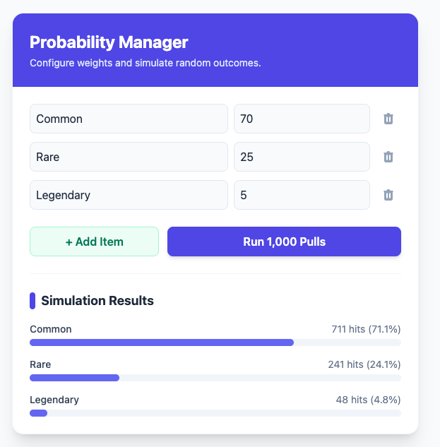

# To Run the Application in this folder

- Open Terminal and ensure the current directory is DSA/standalone/Typescript (Typescript folder is the root of this small app)
- Run `npm install`
- Run `npm start`

This should start the "Vite" build and the server will start listening to default port 5173.(<http://localhost:5173/>)
or which ever port is configured based on availability.

